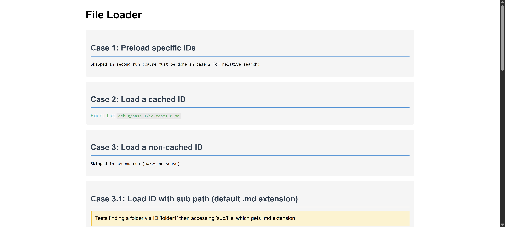

# File Loader

Finds a file by an "id string" in the file name. Enables accessing it when moved.

Alternative: Symfony finder

- [Config](#config)
- [preload_sources()](#preload_sources)
- [add_sources()](#add_sources)
- [source()](#source)
- [find_desc()](#find_desc)
- [Performance](#performance)

## Demo



Config
----------------------------------------------------------

```php
$config = [
  'prefixes'    => ['#', 'id-'],  // ID prefixes to look for
  // 'prefixes' => null,          // no prefixes (tags)
  'loadFolder'  => false,         // load folder path only, instead default is - DESC
  'descPattern' => '/^-\s*DESC/', // Pattern for description files (regex)
  'sharedCache' => null,          // Path to a shared cache file (fallback)

  'msgCallback' => function ( $type, $arg1 = null ) {  // (non-required) callback for ui messages
    switch( $type ) {
      case 'update_cache_start':
        echo "<b>Updating cache for $arg1 ...</b><br>\n";
        break;
      case 'processing_file':
        echo "<b>Processing:</b> $arg1<br>\n";
        break;
      // misc message types: update_cache_end, processing_file_relative
    }
  }
];
```

preload_sources()
----------------------------------------------------------

preload if many, e.g. in case flds renamed (only once for all fil). **Overwrites the entire cache.**

```php
preload_sources({'base_1', 'base_2'], ['MyId', 'MyId2'], 'cache/files.json');
preload_sources({'base_1', 'base_2'], '*', 'cache/files.json');  // see also config
```

add_sources()
----------------------------------------------------------

Add new sources to existing cache without overwriting. Useful for incremental updates.

```php
add_sources({'base_1', 'base_2'], ['NewId', 'AnotherId'], 'cache/files.json');
add_sources({'base_1', 'base_2'], '*', 'cache/files.json');  // see also config
```

Copy add_sources.php to use it from command line

source()
----------------------------------------------------------

```php
$file = source('base_1', 'MyId', 'cache/files.json');

$file = source('base_1', 'MyId/sub/file',     'cache/files.json');  // default ext .md
$file = source('base_1', 'MyId/sub/file.txt', 'cache/files.json');

$file = source('base_1', 'MyId/subfolder', 'cache/files.json');     // will find the - DESC file

$file = source('base_1', 'MyId/subfolder', 'cache/files.json', [
  'loadFolder' => true
  // see config
]);
```

find_desc()
----------------------------------------------------------

```php
$desc_file = find_desc($dir);  // default pattern '/^-\s*DESC/'
$desc_file = find_desc($dir, '/^README/');  // user defined
```

Performance
----------------------------------------------------------

- usgae
  - using a shared cache can improve performance by avoiding repeated searches for common files
- libary
  - performs a relative search from last file location if which is faster than looking through a large file tree
  - the arg base in source() function speeds up cause we don't have to look through all folder if multiple large


LICENSE
----------------------------------------------------------

Copyright (C) Walter A. Jablonowski 2024-2025, free under the [MIT license](LICENSE)

This app is build upon PHP and free software (see [credits](credits.md)).

[Privacy](https://walter-a-jablonowski.github.io/privacy.html) | [Legal](https://walter-a-jablonowski.github.io/imprint.html)
